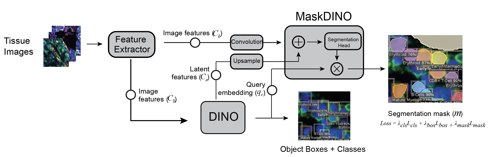

<div align="center">    

# CelloType   


</div>

# Description   
CelloType is an end-to-end Transformer-based method for automated cell/nucleus segmentation and cell type classification  



## Feature Highlights:
- Improved Precision: For both segmentation and classification
- Wide Applicability: Various types of images  (fluorescent, brighfield, natural)
- Multi-scale: Capable of classifying diverse cell types and microanatomical structures


Our codes are based on open-source projects [Detectron2](https://github.com/facebookresearch/detectron2), [Mask DINO](https://github.com/IDEA-Research/MaskDINO).

## Installation
First, install dependencies 
- Linux with Python = 3.8 
- Detectron2: follow [Detectron2](https://detectron2.readthedocs.io/en/latest/tutorials/install.html) installation instructions. 

```bash
# create conda environment
conda create --name cellotype python=3.8
conda activate cellotype
# install pytorch and detectron2
conda install pytorch==1.9.0 torchvision==0.10.0 cudatoolkit=11.1 -c pytorch -c nvidia
python -m pip install 'git+https://github.com/facebookresearch/detectron2.git'
# (add --user if you don't have permission)

# Compile Deformable-DETR CUDA operators
git clone https://github.com/fundamentalvision/Deformable-DETR.git
cd Deformable-DETR
cd ./models/ops
sh ./make.sh

# clone and install the project   
pip install cellotype
```

# Quick started

Clone the repository:

```bash
git clone https://github.com/maxpmx/CelloType.git
cd CelloType
```

Then Download the model weights:

```bash
cd data
sh download.sh
cd ..
```

```python
from skimage import io
from cellotype.predict import CelloTypePredictor

img = io.imread('data/example/example_tissuenet.png') # [H, W, 3]

model = CelloTypePredictor(model_path='./models/tissuenet_model_0019999.pth',
  confidence_thresh=0.3, 
  max_det=1000, 
  device='cuda', 
  config_path='./configs/maskdino_R50_bs16_50ep_4s_dowsample1_2048.yaml')

mask = model.predict(img) # [H, W]
```

# Documentation
The documentation is available at [CelloType](https://cellotype.readthedocs.io/)


### Citation   
```
@article{pang2024cellotype,
  title={CelloType: A Unified Model for Segmentation and Classification of Tissue Images},
  author={Pang, Minxing and Roy, Tarun Kanti and Wu, Xiaodong and Tan, Kai},
  journal={Nature Methods},
  year={2024}
}
```
### Acknowledgement
Many thanks to these projects
- [Detectron2](https://github.com/facebookresearch/detectron2)
- [Mask DINO](https://github.com/IDEA-Research/MaskDINO)
