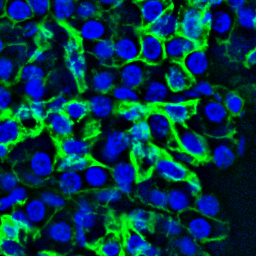

Quickstart
------------------------------

Clone the repository and download the pre-trained models:
~~~~~~~~~~~~~~~~~~~~~~~~~

.. code-block:: bash

    git clone https://github.com/maxpmx/CelloType.git
    cd CelloType

.. code-block:: bash

    cd models
    sh download.sh
    cd ..

Prepare the input images
~~~~~~~~~~~~~~~~~~~~~~~~~

Convert the input images into an RGB format where the blue channel represents the nuclear channel, the green channel corresponds to the membrane channel.

Inference the cell segmentation
~~~~~~~~~~~~~~~~~~~~~~~~~

.. code-block:: python

    from skimage import io
    from cellotype.predict import CelloTypePredictor

    img = io.imread('data/example/example_tissuenet.png') # [H, W, 3]

    model = CelloTypePredictor(model_path='./models/tissuenet_model_0019999.pth',
      confidence_thresh=0.3, 
      max_det=1000, 
      device='cuda', 
      config_path='./configs/maskdino_R50_bs16_50ep_4s_dowsample1_2048.yaml')

    mask = model.predict(img) # [H, W]
