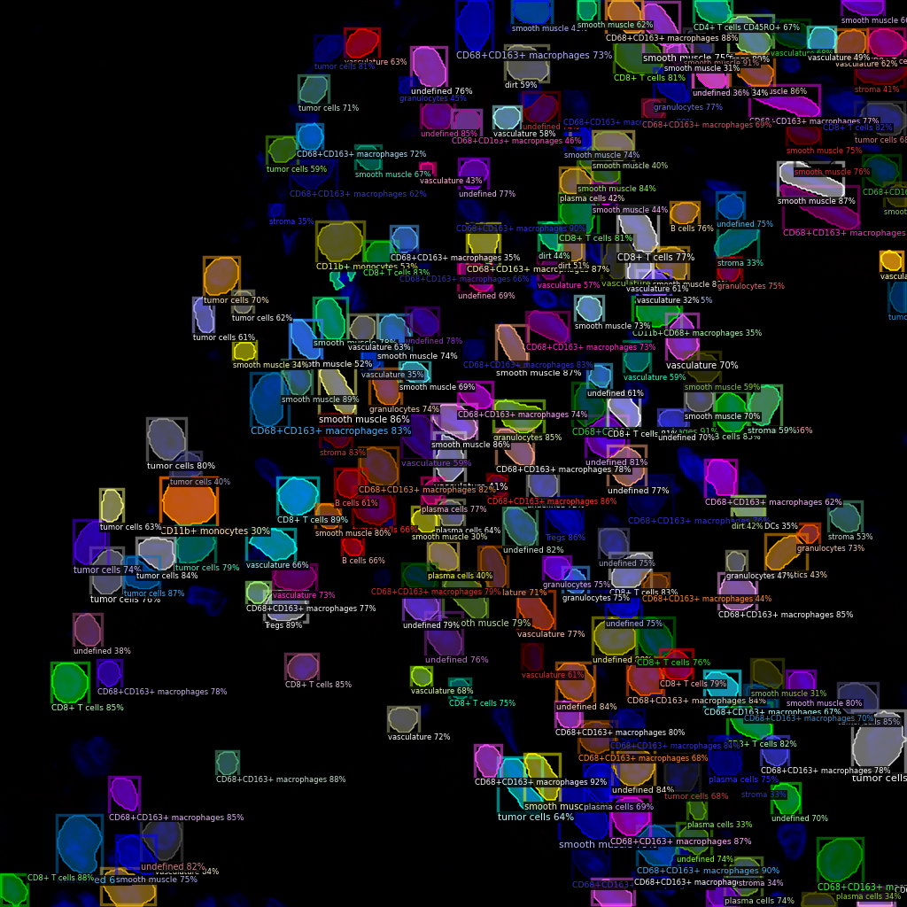

Cell Annotation (Fluorescent Images)
------------------------------

Download data and pretrained models weights
~~~~~~~~~~~~~~~~~~~~~~~~~

Download the processed data
^^^^^^^^^^^^^^^^^^^^^^^^^^^^^^^^^^^^^^^^^^^^^^^^^^^^^^^^^^^^^^

**IMPORTANT**: Note that the raw data is from `Garry P. Nolan Lab <https://doi.org/10.7937/tcia.2020.fqn0-0326>`_, this processed data is for demo purpose ONLY!

Download ``data/example_codex_crc.zip`` from the `Drive <https://upenn.box.com/s/str98paa7p40ns32mchhjsc4ra92pumv>`_ and put it in the ``data`` folder. Then unzip it.

.. code-block:: bash

    cd data
    unzip example_codex_crc.zip
    cd ..

Download COCO pretrained models weights (optional)
^^^^^^^^^^^^^^^^^^^^^^^^^^^^^^^^^^^^^^^^^^^^^^^^^^^^^^^^^^^^^^

Download ``models/maskdino_swinl_50ep_300q_hid2048_3sd1_instance_maskenhanced_mask52.3ap_box59.0ap.pth`` from the `Drive <https://upenn.box.com/s/str98paa7p40ns32mchhjsc4ra92pumv>`_ and put it in the ``cellotype/models`` folder.

Train model
~~~~~~~~~~~~~~~~~~~~~~~~~

Note: If you want to train the model using multi-channel images with a number of channels other than 3, you can modify the ``cfg.MODEL.IN_CHANS`` setting in the ``train_crc.py`` script.

.. code-block:: bash

    python train_crc.py --num-gpus 4

The parameters are optimized for 4\*A100 (40GB) environment, if your machine does not have enough GPU memory, you can reduce the batch size by changing the ``IMS_PER_BATCH`` in ``configs/Base-COCO-InstanceSegmentation.yaml``. For reference, the training takes ~12 hours on 4\*A100 (40GB) environment.

Test model and visualize results
~~~~~~~~~~~~~~~~~~~~~~~~~

For reference, our trained weights ``models/crc_model_0005999.pth`` can be downloaded from the `Drive <https://upenn.box.com/s/str98paa7p40ns32mchhjsc4ra92pumv>`_ folder.

.. code-block:: bash

    python test_crc.py --num-gpus 1

The example prediction saved in the ``output/codex`` folder.

